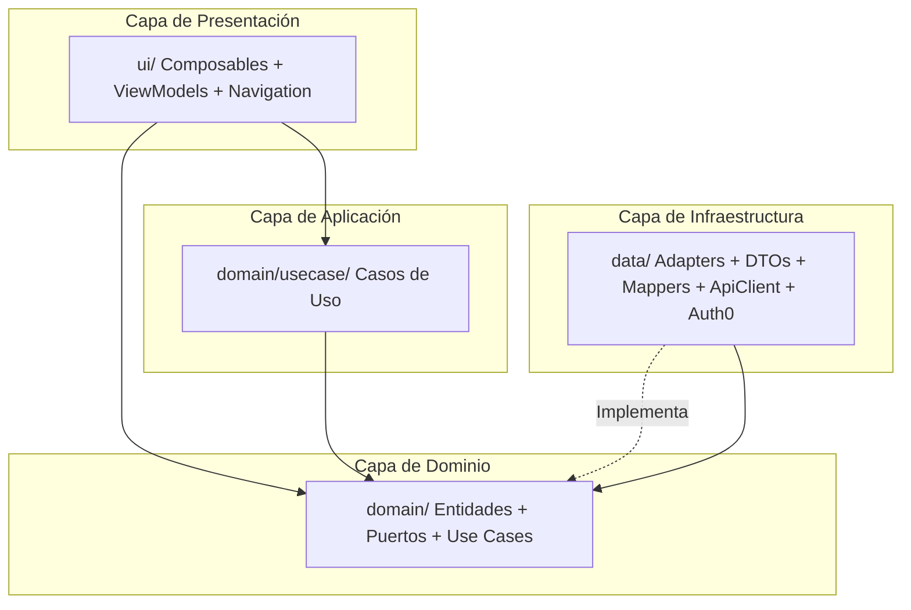

# AGENTS.md — LoResuelvo Android Service Provider

Última actualización: 2026-08-24 (Fase 1 — US-33 Pantalla inicial de bienvenida prestador)

Fuente canónica para agentes. Leer este archivo primero y cargar skills locales solo cuando apliquen. La documentación para humanos vive en `README.md` (setup y comandos).

## Modo skills-first

1. Leer las reglas globales de este archivo.
2. Elegir la skill adecuada del índice de skills.
3. Cargar solo `skills/<skill>/SKILL.md` y referencias puntuales cuando apliquen.
4. Evitar abrir documentación o código no relacionado con la tarea.

## Estado actual: Fase 1 (Walking skeleton BDD/TDD)

**Objetivo**: introducir Hilt + KSP + Retrofit + Auth0 + Navigation Compose, junto con el primer `.feature` real (`provider-welcome.feature`) y su Welcome screen completo para prestadores. La infra de BDD/TDD queda validada para futuras US.

**Lo que entra en esta fase** (Fase 1):

- ✅ Hilt + KSP + KAPT (con `force("com.squareup:javapoet:1.13.0")`).
- ✅ Retrofit + OkHttp + `kotlinx-serialization` + `retrofit2-kotlinx-serialization-converter`.
- ✅ Auth0 SDK 2.11.0 (`WebAuthProvider` con Universal Login).
- ✅ Navigation Compose con `Route` + `LoResuelvoNavHost` + `LoResuelvoNav` (Welcome como `startDestination`).
- ✅ Clean Architecture liviana + Ports & Adapters (espejo del consumer).
- ✅ `.feature` BDD con escenarios `@wip` + step defs (esperando destrabar).

**Lo que NO está todavía**:

- Home del prestador (la ruta existe en `Route.Home` pero renderiza un placeholder).
- Perfil / categorías profesionales / zona de cobertura / descripción.
- Post-auth sync (`GET /me`) y refresh tokens.
- Conversaciones con clientes, multimedia, etc.
- Smart-router (Welcome cuando no hay sesión, Home cuando hay sesión). Llega con la primera US autenticada.

---

## Stack tecnológico

- **Lenguaje/Build**: Kotlin 2.0.21, AGP 8.13.2, Gradle Wrapper, `libs.versions.toml` como catálogo de versiones.
- **UI**: Jetpack Compose (BOM 2024.09), Material 3, Navigation Compose (`androidx.navigation:navigation-compose`), `minSdk 24` / `targetSdk 35`.
- **Estado**: `StateFlow` + UDF. Los `UiState` son `data class` inmutables; los `ViewModel` exponen `StateFlow<UiState>`.
- **DI**: Hilt + `hilt-navigation-compose` para `hiltViewModel()` en composables. `LoresuelvoApp` con `@HiltAndroidApp`. `MainActivity` con `@AndroidEntryPoint`.
- **Auth**: Auth0 SDK 2.11.0.
- **Networking**: Retrofit 2.11.0 + OkHttp 4.12.0 + `kotlinx-serialization` 1.7.3.
- **Storage**: EncryptedSharedPreferences (AES256_GCM/SIV) para tokens.
- **Testing**: JUnit4, MockK, Turbine, `kotlinx-coroutines-test`, Robolectric, `okhttp-mockwebserver`, Compose-test, Cucumber JVM 7.x para BDD, Hilt Android Testing.

## Arquitectura (Clean Architecture liviana + Ports & Adapters)

El proyecto sigue una estructura limpia de capas desacopladas, protegiendo el dominio de la infraestructura y de la UI.



- **Capa de Dominio (`domain/`)**: tipos puros, entidades, value objects, **puertos** (interfaces) y casos de uso. **PURO**: no importa `data/`, `ui/`, `android.*`, ni libs externas (`okhttp3`, `retrofit2`, `kotlinx.serialization`, `dagger`, `hilt`). Validar con grep.
- **Capa de Infraestructura (`data/`)**: adapters que implementan los puertos del dominio. DTOs snake_case del backend con `@SerialName`, mappers DTO↔dominio, `ApiClient`, `Auth0AuthProvider`, `EncryptedAuthSessionStore`, etc. **Único lugar donde pueden vivir DTOs.**
- **Capa de Aplicación (`domain/usecase/`)**: casos de uso que orquestan puertos. Sin estado. **No** tragan errores: propagan excepciones o traducen a `sealed interface XxxOutcome` con `Success`/`Failure` tipados.
- **Capa de Presentación (`ui/`)**: composables, `ViewModel`s, navegación, theme, componentes reutilizables.

### Patrones aplicados explícitamente

- **Observer**: `StateFlow` + `collectAsState()` en composables; `viewModelScope.launch` en ViewModels.
- **Adapter**: `ApiCategoryRepository` adapta el cliente HTTP al puerto `CategoryRepository`; `Auth0AuthProvider` adapta el SDK de Auth0 al puerto `AuthProvider`. Ver `data/auth/Auth0AuthProvider.kt:16-37` y `data/api/ApiCategoryRepository.kt:16-32`.
- **Factory**: Hilt actúa como factory de dependencias. Los ViewModels se obtienen con `hiltViewModel()` en composables. **No** usar `viewModelFactory { initializer { ... } }` en producción.
- **Dependency Injection**: Hilt. **Cero** `object` global mutable nuevo.

### Regla de dependencia estricta

**Las capas internas nunca dependen de capas externas.** `domain/` y `domain/usecase/` no deben importar nada de `data/`, `ui/`, `android.*`, ni libs externas. Si un test falla, el build falla.

```bash
# Validación rápida (debe devolver 0 líneas)
grep -RInE "import (com\.loresuelvo\.serviceprovider\.(data|application|ui)|android\.|dagger|hilt|okhttp3|retrofit2|kotlinx\.serialization)" \
  app/src/main/java/com/loresuelvo/serviceprovider/domain/
```

### Regla de pureza del dominio

Los tipos en `domain/` siempre son **camelCase**. Si el backend devuelve `given_name` o `profile_photo_url`, el dominio define `givenName` y `profilePhotoUrl`. La conversión ocurre exclusivamente en mappers dentro de `data/` (ej: `data/api/mapper/CategoryMapper.kt`).

### Regla de DTOs

DTOs del backend (snake_case, anotados con `@SerialName`) **solo** viven en `data/api/dto/`. Nunca se filtran a `domain/` ni a `ui/`. Mapeo en `data/api/mapper/`.

---

## Estructura de carpetas

```txt
app/
  src/
    main/
      java/com/loresuelvo/serviceprovider/
        MainActivity.kt                       # @AndroidEntryPoint, setContent { LoresuelvoTheme { LoResuelvoNav() } }
        LoresuelvoApp.kt                      # @HiltAndroidApp
        data/                                 # Adapters, DTOs, mappers, ApiClient, Auth0
          auth/                               # Auth0AuthProvider, Auth0WebAuthLauncher, EncryptedSessionPrefs, EncryptedAuthSessionStore
          api/                                # BackendApi, AuthInterceptor, ApiCategoryRepository, ApiErrorMapping, ApiConfig
          api/dto/                            # CategoryDto, ApiErrorDto
          api/mapper/                         # CategoryMapper
        domain/                               # PURO: entidades, puertos, casos de uso
          auth/                               # AuthProvider, AuthSessionStore, AuthenticationOutcome, LogoutOutcome, User, AuthSession
          category/                           # Category, CategoriesOutcome, CategoryRepository
          usecase/category/                   # GetCategoriesUseCase
          api/                                # ApiError (sealed)
        di/                                   # Hilt modules
        ui/
          auth/                              # WelcomeVM/State
          components/                        # Botones (PrimaryButton, GoogleButton), branding (AppLogo)
          navigation/                        # LoResuelvoNav, LoResuelvoNavHost, Route
          screens/auth/                      # WelcomeScreen + components (Scaffold, TopBar, Hero, HowItWorksStep, VerificationBadge, CategoryChipRow)
          theme/                             # Color.kt, Theme.kt
      res/
        values/strings.xml                    # Strings de UI en español (default)
        values-en/strings.xml                 # Strings en inglés
        values/arrays.xml                     # welcome_categories (es)
        values-en/arrays.xml                  # welcome_categories (en)
        drawable-nodpi/logo.png               # Branding
        xml/                                  # backup_rules, data_extraction_rules, locales_config
    test/
      java/.../bdd/
                      # BddSmokeCucumberTest + BddSmokeSteps (smoke)
                      # auth/welcome/  -> WelcomeCucumberTest + WelcomeSteps + CucumberWorld + FakeAuthProvider + FakeCategoryRepository
      java/.../ui/auth/WelcomeViewModelTest.kt
      resources/features/smoke/BddSmoke.feature
      resources/features/auth/provider-welcome.feature
    androidTest/
      java/.../HiltTestRunner.kt
      java/.../acceptance/auth/WelcomeScreenAcceptanceTest.kt
      java/.../ExampleInstrumentedTest.kt
skills/                                      # Skills locales para agentes (Fase 1+)
AGENTS.md                                    # Este archivo (canónico)
CLAUDE.md                                    # Apunta a AGENTS.md
README.md                                    # Setup + comandos + troubleshooting
```

---

## Comandos de validación

Comandos actuales del repo:

```bash
make help
make build         # assembleDevDebug
make lint          # lintDevDebug
make test          # testDevDebugUnitTest (incluye BDD Cucumber)
make e2e           # connectedDevDebugAndroidTest con package=...acceptance
make test-all-once # test + e2e
make ci            # build + lint + test-all-once
make clean
make devices
```

Variables: `FLAVOR=Dev|Staging|Prod` (default: `Dev`).

### Política

1. **TDD/BDD primero**: el test se escribe antes del impl. RED local, GREEN local, REFACTOR.
2. **Durante iteración**: ejecutar pruebas focalizadas (`./gradlew :app:testDevDebugUnitTest --tests *WelcomeViewModelTest*`).
3. **Antes de PR**: `make lint && make test && make build` verde. Si cambió un flujo BDD, también `make e2e`.
4. **Antes de merge a `main`**: `make ci` verde completo.
5. **Fail-fast**: detenerse en la primera falla, corregir y re-ejecutar.

---

## Flavors

Tres flavors (`dev`/`staging`/`prod`) sobre el dimension `environment`. Cada uno expone `BuildConfig.API_URL`, `BuildConfig.AUTH0_DOMAIN`, `BuildConfig.AUTH0_CLIENT_ID`, `BuildConfig.AUTH0_SCHEME` y `BuildConfig.AUTH0_AUDIENCE`.

| Flavor    | applicationId                       | versionNameSuffix |
|-----------|-------------------------------------|-------------------|
| `dev`     | `com.loresuelvo.serviceprovider.dev`| `-dev`            |
| `staging` | `com.loresuelvo.serviceprovider.staging` | `-staging`    |
| `prod`    | `com.loresuelvo.serviceprovider`    | (none)            |

El scheme de Auth0 por flavor:

| Flavor    | `AUTH0_SCHEME` por defecto          |
|-----------|-------------------------------------|
| `dev`     | `com.loresuelvo.provider`           |
| `staging` | `com.loresuelvo.provider.staging`   |
| `prod`    | `com.loresuelvo.provider.prod`      |

Lectura de variables: prioridad `local.properties` > gradle property > env > default. Ver `app/build.gradle.kts:34-39` (`envVar(...)`).

---

## CI / CD

- **CI** (`.github/workflows/ci.yml`): corre en cada push a `main` y cada PR. Ejecuta `make lint`, `make test`, `make e2e` con un AVD Pixel 2 API 35 prewarming y snapshot `ci-clean`, y `make build` para `FLAVOR=Staging`. Las credenciales se inyectan desde GitHub Secrets.
- **Bootstrap AVD** (`.github/workflows/avd-bootstrap.yml`): workflow manual que crea y guarda el snapshot prewarming usado por CI. Incrementar `cache_version` al cambiar la configuración del emulador.
- **Release** (`.github/workflows/release.yml`): corre cuando se pushea un tag `v*.*.*`. Construye Staging APK y Prod AAB, los sube como artifacts, y depende de los environments `staging` y `production` para protección.

Secrets requeridos en GitHub:

- `AUTH0_DOMAIN_STAGING`, `AUTH0_CLIENT_ID_STAGING`, `AUTH0_AUDIENCE_STAGING`, `API_URL_STAGING`.
- `AUTH0_DOMAIN_PROD`, `AUTH0_CLIENT_ID_PROD`, `AUTH0_AUDIENCE_PROD`, `API_URL_PROD`.
- `AUTH0_CLIENT_SECRET_STAGING`, `AUTH0_CLIENT_SECRET_PROD` (sólo release).
- `AUTH0_SCHEME_STAGING`, `AUTH0_SCHEME_PROD` (sólo release).
- `NEXT_PUBLIC_PUBLIC_MEDIA_BASE_URL_STAGING`, `NEXT_PUBLIC_PUBLIC_MEDIA_BASE_URL_PROD` (sólo release).

`AUTH0_SCHEME_STAGING` y `AUTH0_SCHEME_PROD` tienen defaults en `app/build.gradle.kts`; el CI los sobrescribe explícitamente para self-documentar el contrato.

---

## BDD con Cucumber JVM

La capa BDD vive **en el source set de JVM** (`src/test/`), no en `androidTest/`:

- `.feature`: `app/src/test/resources/features/<area>/<user-journey>.feature`
- Step definitions + glue runner: `app/src/test/java/com/loresuelvo/serviceprovider/bdd/<area>/<journey>/...`

Filtro actual: `cucumber.filter.tags=not @wip` configurado en `app/build.gradle.kts:84-93`. Cada `.feature` nuevo arranca con escenarios marcados `@wip` y se destraban cuando el step def + impl están listos.

Cada runner BDD usa su **propio glue package** (no un umbrella recursivo) para evitar que dos runners registren los mismos step defs y Cucumber tire `DuplicateStepDefinitionException`. Ver `BddSmokeCucumberTest` (`glue = bdd.smoke`) vs `WelcomeCucumberTest` (`glue = bdd.auth.welcome`).

Referencia completa del proceso BDD/TDD: skill `android-bdd-tdd-process` (espejo del consumer).

---

## Reglas críticas (Fase 1+)

### Topología (regla de `MainActivity`)

- `MainActivity.onCreate` debe ser **≤ 15 líneas** y limitarse a:
  ```kotlin
  @AndroidEntryPoint
  class MainActivity : ComponentActivity() {
      override fun onCreate(savedInstanceState: Bundle?) {
          super.onCreate(savedInstanceState)
          setContent {
              LoresuelvoTheme {
                  LoResuelvoNav()
              }
          }
      }
  }
  ```
- **`@AndroidEntryPoint` es OBLIGATORIO.** Sin él, el primer `hiltViewModel()` que se invoque desde el composable crashea el proceso con `IllegalStateException: Given component holder class MainActivity does not implement interface dagger.hilt.internal.GeneratedComponent`.
- Toda la lógica de composición (NavHost, decisión de `startDestination`, `composable` con `hiltViewModel()`) vive en `LoResuelvoNav`.

### Calidad

- Alta cohesión, bajo acoplamiento, estricto desacoplamiento de capas.
- **Una responsabilidad por archivo**. No agrupar `WelcomeScreen` + `CompleteProfileScreen` en un solo `AuthScreens.kt`.
- Tipos explícitos en fronteras de API, auth y datos compartidos.
- Preferir `sealed interface` para outcomes de use cases y errores de UI.
- **Patrón UDF**: `UiState` inmutable, eventos como `sealed interface XxxEvent` emitidos por `Channel` o `SharedFlow`.
- **No** introducir `object` global mutable nuevo.

### Use cases y errores

- Los use cases **no** tragan errores. Traducen `ApiError` a `XxxOutcome.Failure.*` tipado, o propagan la excepción.
- Cada use case es una clase con un solo `operator fun invoke(...)`. Nombre: `VerbSubjectUseCase`.
- Los `Outcome.Failure` deben ser `sealed interface` con subclases tipadas, no strings.

### i18n

- **Todo** texto visible al usuario debe estar en `app/src/main/res/values/strings.xml` (es) y `values-en/strings.xml` (en).
- Cero literales en español en `app/src/main/java/.../`.

### Logging

- **Cero** `Log.d/w/e` directo en `app/src/main/`. Usar `Logger.*` (gated por `BuildConfig.DEBUG`) cuando llegue el módulo.
- No loguear payloads ni tokens.

### Seguridad

- Cero secretos en código. La configuración pública de Auth0 y la URL del backend se leen de `BuildConfig` con fallbacks; los valores reales vienen de `local.properties` o del pipeline.
- No commitear `local.properties`. Está en `.gitignore`.
- Tokens: nunca se loguean, nunca se persisten en `SharedPreferences` plano. `EncryptedAuthSessionStore` usa `EncryptedSharedPreferences` (AES256_GCM/SIV).
- **Cleartext HTTP**: bloqueado por defecto (`targetSdk 35`). Para dev en LAN/loopback usar `adb reverse tcp:8080 tcp:8080` + `API_URL=http://127.0.0.1:8080` (sólo `devDebug` lo permite). **Staging/prod son HTTPS-only**.

### DI (Hilt)

- `@HiltAndroidApp` en `LoresuelvoApp`. `@AndroidEntryPoint` en `MainActivity`. `@HiltViewModel` en todos los ViewModels.
- Módulos: `di/NetworkModule`, `di/RepositoryModule`, `di/AuthModule`, `data/auth/SessionStoreModule`. Cada uno con `@InstallIn(SingletonComponent::class)` según el scope.
- Repositorios: `@Binds @Singleton` en `RepositoryModule`. No instanciar repos a mano.
- ViewModels: `hiltViewModel<T>()` en composables. **No** usar `viewModelFactory { initializer { ... } }` en producción.
- Tests con Hilt: `@HiltAndroidTest` + `@UninstallModules(...)` + `@TestInstallIn(..., replaces = [...])` que provee fakes. Ver skill `android-hilt-governance`.

### Aceptación: mutar el session store desde tests

- `EncryptedAuthSessionStore` está `@Singleton` y la `MainActivity` observa el mismo flow. Para mutarlo desde acceptance tests, resolver vía `@EntryPoint`:
  ```kotlin
  private val sessionStore: AuthSessionStore by lazy {
      EntryPointAccessors.fromApplication(
          ApplicationProvider.getApplicationContext<Application>(),
          AuthSessionStoreEntryPoint::class.java,
      ).authSessionStore()
  }
  ```

### Aceptación: Locale del CI

- El emulator del CI bootea con `en-US` por default. `WelcomeScreen` (y todos los Composables que usen `stringResource(R.string.*)`) renderizan la versión `values-en/strings.xml`.
- Los acceptance tests no deben asumir el locale del dispositivo. Resolver el mismo recurso desde la Activity de la regla Compose:
  ```kotlin
  private fun localizedString(@StringRes resourceId: Int): String =
      composeTestRule.activity.getString(resourceId)
  ```
- Ver `WelcomeScreenAcceptanceTest`. Los strings visibles siguen definidos en `values/strings.xml` y `values-en/strings.xml`.

### Dependencias

- **No** agregar deps nuevas sin discutir versiones en `libs.versions.toml` y este archivo.
- La regla de Hilt + KSP requiere `force("com.squareup:javapoet:1.13.0")` en el buildscript classpath. No remover hasta que Hilt 2.51+ lo arregle.

---

## Índice de skills (a poblar en Fase 1+)

Cuando copiemos/adaptemos skills del consumer, deberían vivir en `skills/<skill>/SKILL.md`. Aún no hay skills copiados.

---

## Mapa rápido de decisión

- "¿Toco una capa o import entre capas?": `android-clean-architecture` (espejo del consumer).
- "¿Voy a escribir código con tests?": `android-bdd-tdd-process` (espejo del consumer).
- "¿Estoy por cerrar un PR / quiero validar antes de pushear?": `android-testing-gates` (espejo del consumer).
- "¿Voy a tocar el cliente HTTP, DTOs, mappers, interceptors?": `android-api-client-governance` (espejo del consumer).
- "¿Voy a agregar un módulo Hilt, un `@HiltViewModel`, o un test con Hilt?": `android-hilt-governance` (espejo del consumer).
- "¿Voy a tocar `AGENTS.md`, `CLAUDE.md`, skills o `README.md`?": `android-doc-governance` (espejo del consumer).
- "¿Voy a hacer commit o PR?": `android-commit-governance` (espejo del consumer).

---

## Idioma y estilo

- Texto visible para usuarios: español, centralizado en `strings.xml`.
- Código, tests, nombres de variables, comentarios técnicos: inglés.
- Steps de BDD: español (alineado con el webapp y consumer).
- Commits y mensajes de PR: inglés, Conventional Commits.
- Comentarios explicativos (que agreguen info, no describan lo obvio) en español.

---

## Checklist final para agentes (Fase 1+)

1. **No** agregar dependencias nuevas. Si la tarea las pide, abrir thread antes.
2. TDD/BDD primero: el test (unit + `.feature` + step def) se escribe antes del impl.
3. Diff revisado: sin archivos generados accidentales, sin archivos debug.
4. Sin secretos, sin logs sensibles, sin literales en español en código.
5. Cero `Log.d/e/w` directo en código de producción.
6. Strings de UI en `strings.xml` (es + en).
7. `domain/` permanece puro (verificar con grep antes de PR).
8. `make lint && make test && make build` verde.
9. Si cambió un flujo BDD o un composable, `make e2e` verde.
10. `AGENTS.md` actualizado si cambió arquitectura, convención, o comandos.
11. Resumen final conciso con archivos tocados, validación y riesgos residuales.
